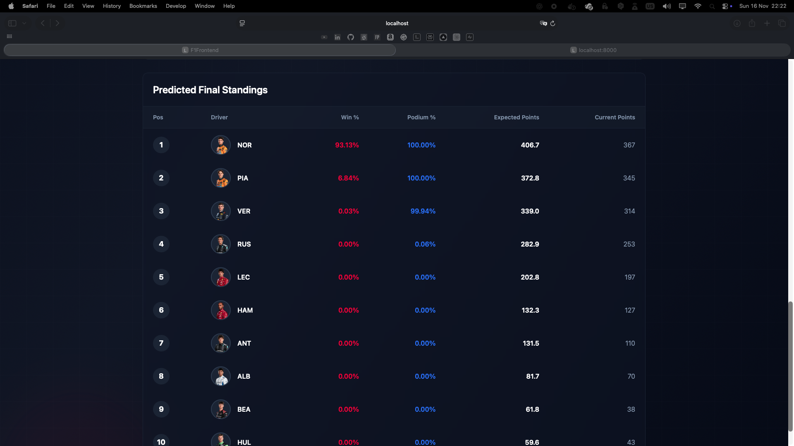

# Formula 1 2025 Championship Prediction System

[](https://www.python.org/downloads/)
[](https://fastapi.tiangolo.com)
[](https://angular.io)
[](LICENSE)
[](https://www.docker.com/)

> A machine learning system for predicting Formula 1 World Championship outcomes using Bayesian inference, Monte Carlo simulation, and ensemble methods, powered by official FastF1 telemetry data.

---

## Table of Contents

- [Overview](#overview)
- [Prediction Results](#prediction-results)
- [Theoretical Foundation](#theoretical-foundation)
  - [Bayesian Variance Decomposition](#bayesian-variance-decomposition)
  - [Monte Carlo Championship Simulation](#monte-carlo-championship-simulation)
  - [Ensemble Machine Learning](#ensemble-machine-learning)
  - [Hybrid Prediction Approach](#hybrid-prediction-approach)
- [Installation & Usage](#installation--usage)
  - [Docker Deployment](#docker-deployment)
  - [Local Installation](#local-installation)
  - [Running Predictions](#running-predictions)
- [System Architecture](#system-architecture)
- [Research Foundation](#research-foundation)
- [License](#license)

---

## Overview

This system predicts the 2025 Formula 1 World Championship final standings using three complementary methodologies:

1. **Bayesian Analysis** - Decomposes race performance into driver skill and constructor contributions
2. **Monte Carlo Simulation** - Models championship outcomes through 10,000+ stochastic race simulations
3. **Ensemble Learning** - Random Forest, Gradient Boosting, and SVR models trained on 2022-2024 data

The hybrid approach combines machine learning baseline predictions with Monte Carlo uncertainty modeling to generate championship win probabilities and expected final standings.

**Data Source**: All race data is sourced from the official **FastF1 API**, providing authentic telemetry and timing data from 2022-2025.

---

## Prediction Results



The system predicts final championship standings with win probabilities, podium chances, and expected points for each driver based on 10,000 Monte Carlo simulations.

---

## Theoretical Foundation

### Bayesian Variance Decomposition

The Bayesian module decomposes race performance variance into **driver skill** and **constructor performance** components using ANOVA-style variance partitioning.

#### Total Variance

Given race results with finish positions $P$, the total variance is:

$$\sigma^2_{\text{total}} = \text{Var}(P)$$

#### Between-Team Variance (Constructor Effect)

The variance attributable to team/constructor differences:

$$\sigma^2_{\text{between}} = \frac{1}{N} \sum_{t} n_t \left( \mu_t - \mu_{\text{grand}} \right)^2$$

where:
- $\mu_t$ = mean finish position for team $t$
- $\mu_{\text{grand}}$ = grand mean finish position across all drivers
- $n_t$ = number of observations for team $t$
- $N$ = total observations

#### Within-Team Variance (Driver Skill)

The variance attributable to driver skill differences within teams:

$$\sigma^2_{\text{within}} = \sigma^2_{\text{total}} - \sigma^2_{\text{between}}$$

#### Contribution Percentages

$$\text{Constructor Contribution} = \frac{\sigma^2_{\text{between}}}{\sigma^2_{\text{total}}} \times 100\%$$

$$\text{Driver Contribution} = \frac{\sigma^2_{\text{within}}}{\sigma^2_{\text{total}}} \times 100\%$$

#### Driver Skill Adjustment

For each driver-team combination, we calculate a skill adjustment relative to team baseline:

$$\text{Skill}_{\text{adj}}(d, t) = \mu_t - \mu_{d|t}$$

where:
- $\mu_t$ = team's average finish position across all drivers
- $\mu_{d|t}$ = specific driver's average when driving for that team

A positive adjustment indicates the driver performs better than their team average (high skill), while a negative adjustment indicates underperformance.

---

### Monte Carlo Championship Simulation

The Monte Carlo simulator runs $N = 10,000$ stochastic race simulations to model championship outcomes under uncertainty.

#### Position Sampling

For each driver $d$ in team $t$, the finish position is sampled from a hierarchical distribution:

**Hybrid Mode** (ML-informed):
$$P_{d,t} \sim \mathcal{N}\left(\mu_{\text{ML}}(d, t), \sigma_{\text{hist}}(d, t)\right)$$

**Pure Historical Mode**:
$$P_{d,t} \sim \text{Historical}_{\text{dist}}(d, t)$$

where $\mu_{\text{ML}}$ is the machine learning predicted position and $\sigma_{\text{hist}}$ is the historical performance variance.

#### DNF (Did Not Finish) Modeling

The probability of a driver DNF is computed as:

$$P_{\text{DNF}}(d, t, k) = \frac{P_{\text{DNF}}^{\text{driver}}(d) + P_{\text{DNF}}^{\text{team}}(t) + P_{\text{DNF}}^{\text{track}}(k)}{3}$$

where $k$ represents the track type (street circuit, high-speed, technical, etc.).

If $U \sim \text{Uniform}(0, 1) < P_{\text{DNF}}$, the driver is assigned position 21 (DNF) with 0 points.

#### Weather Impact

Wet weather probability varies by track type. When wet conditions occur:

$$P_{\text{adjusted}} = P_{\text{dry}} - \alpha_{\text{wet}}(d) + \mathcal{N}(0, c \cdot \sigma)$$

where:
- $\alpha_{\text{wet}}(d)$ = driver's wet weather skill advantage (historical)
- $c \in [1.2, 1.5]$ = chaos multiplier for increased variance in wet conditions

#### Safety Car Chaos

When a safety car deploys (probability $P_{\text{SC}}$ by track type):

$$P_{\text{SC\\_adjusted}} = P_{\text{sampled}} + \mathcal{N}(0, v_k \cdot 0.5)$$

where $v_k$ is the track-specific position volatility (typically 3-4 positions for street circuits).

#### Championship Probability Estimation

After $N$ simulations, the championship win probability for driver $d$ is:

$$P_{\text{win}}(d) = \frac{1}{N} \sum_{i=1}^{N} \mathbb{1}\left[\text{Position}_d^{(i)} = 1\right]$$

with margin of error $\approx \pm 1\%$ at 95% confidence (by Central Limit Theorem for $N=10,000$).

---

### Ensemble Machine Learning

The ensemble module trains three regression models to predict finish position (1-20) based on engineered features.

#### Model Architectures

**1. Random Forest Regressor**
- Trees: 834 (optimized via grid search)
- Feature subsampling: $\sqrt{p}$ where $p$ = number of features
- Bootstrapping with replacement for each tree

**2. Gradient Boosting Regressor**
- Trees: 2000
- Learning rate: $\eta = 0.01$
- Max depth: 3 (shallow trees to prevent overfitting)

**3. Support Vector Regressor**
- Kernel: Radial Basis Function (RBF)
- Regularization: $C = 1000$
- Kernel coefficient: $\gamma = \text{scale}$

#### Feature Engineering

The system computes 50+ features per race entry:

- **Recent Form**: Rolling 10-race averages (finish position, points, DNF rate)
- **Championship Standing**: Current position, points gap to leader
- **Team Performance**: Season averages, teammate comparisons
- **Track-Specific**: Performance on 6 track type categories
- **Grid Position**: Qualifying position (linear and quadratic terms)
- **Bayesian Priors**: Driver skill adjustments, team strength metrics

#### Evaluation Metrics

Model performance is evaluated using:

**Regression Metrics**:
$$\text{RMSE} = \sqrt{\frac{1}{n}\sum_{i=1}^{n}(y_i - \hat{y}_i)^2}$$

$$\text{MAE} = \frac{1}{n}\sum_{i=1}^{n}|y_i - \hat{y}_i|$$

$$R^2 = 1 - \frac{\sum_{i}(y_i - \hat{y}_i)^2}{\sum_{i}(y_i - \bar{y})^2}$$

**Ranking Metrics**:
$$\rho_{\text{Spearman}} = \text{corr}\left(\text{rank}(y), \text{rank}(\hat{y})\right)$$

$$\tau_{\text{Kendall}} = \frac{n_{\text{concordant}} - n_{\text{discordant}}}{n(n-1)/2}$$

#### Leave-One-Year-Out Cross-Validation

To ensure generalization to future seasons, models are validated using LOYO-CV:

For each year $y \in \{2022, 2023, 2024\}$:
- Train on: $\mathcal{D}_{\text{train}} = \{2022, 2023, 2024\} \setminus \{y\}$
- Test on: $\mathcal{D}_{\text{test}} = \{y\}$

This prevents temporal leakage where future information influences past predictions.

---

### Hybrid Prediction Approach

The production system combines ML and Monte Carlo methods:

**Step 1**: Train ensemble model on historical data (2022-2024)

**Step 2**: Generate ML baseline predictions for remaining 2025 races

**Step 3**: Use ML predictions as distribution means in Monte Carlo:
$$P_{d,t}^{\text{race}} \sim \mathcal{N}\left(\mu_{\text{ML}}(d, t), \sigma_{\text{hist}}(d, t)\right)$$

**Step 4**: Run 10,000 championship simulations incorporating DNFs, weather, and safety cars

**Step 5**: Aggregate results to compute:
- $P_{\text{win}}(d)$ = Championship win probability
- $E[\text{Position}_d]$ = Expected final position
- 95% confidence intervals for points and positions

**Advantages**:
- ML captures recent trends and feature relationships
- Monte Carlo models uncertainty and rare events (DNFs, weather)
- Hybrid approach quantifies prediction confidence

---

## Installation & Usage

### Docker Deployment

**Prerequisites**: Docker 20.10+ and Docker Compose 1.29+

**1. Clone and Configure**
```bash
git clone <repository-url>
cd formula_1_championship_prediction
cp .env.example .env
```

**2. Build and Start**
```bash
docker-compose up --build
```

**3. Access Application**
- **Frontend**: http://localhost:80
- **API Documentation**: http://localhost:8000/docs
- **API Health Check**: http://localhost:8000/health

---

### Local Installation

**Prerequisites**: Python 3.11+, Node.js 22+

**Backend Setup**
```bash
# Create virtual environment
python3.11 -m venv venv
source venv/bin/activate  # Windows: venv\Scripts\activate

# Install dependencies
pip install -r requirements.txt
```

**Frontend Setup**
```bash
cd f1_frontend
npm install
```

---

### Running Predictions

**Full Pipeline Execution**
```bash
# 1. Download historical data (2022-2025)
python scripts/download_data.py

# 2. Preprocess data
python scripts/preprocess_data.py

# 3. Engineer features
python scripts/feature_engineering.py

# 4. Train models
python scripts/train_models.py

# 5. Generate 2025 predictions
python scripts/predict_2025.py
```

**Start API Server**
```bash
uvicorn api.main:app --reload --host 0.0.0.0 --port 8080
```

**Start Frontend**
```bash
cd f1_frontend
npm start  # Opens http://localhost:4200
```

**Run Simulation via API**
```bash
curl -X POST "http://localhost:8000/api/v1/simulate?n_simulations=10000"
```

---

## System Architecture

### High-Level Architecture

```
┌─────────────────────────────────────────────────────────┐
│                   Angular Frontend                       │
│         (Championship predictions visualization)         │
└───────────────────────┬─────────────────────────────────┘
                        │ HTTP/REST
                        ▼
┌─────────────────────────────────────────────────────────┐
│                   FastAPI Backend                        │
│              (Simulation & prediction API)               │
└───────────────────────┬─────────────────────────────────┘
                        │
         ┌──────────────┼──────────────┐
         ▼              ▼              ▼
    Bayesian      Monte Carlo     Ensemble
    Analysis      Simulator       Models
         │              │              │
         └──────────────┴──────────────┘
                        │
                        ▼
              Feature Engineering
                        │
                        ▼
               FastF1 Data Loader
                        │
                        ▼
                  FastF1 API
            (Official F1 telemetry)
```

### Data Pipeline

```
FastF1 API
    ↓
Raw Race Results (2022-2025)
    ↓
Preprocessing (DNF detection, normalization)
    ↓
Feature Engineering (50+ features)
    ↓
Feature Matrix
    ├─→ Model Training (LOYO-CV)
    ├─→ Monte Carlo Simulation
    └─→ Bayesian Analysis
        ↓
Championship Predictions
        ↓
    API Endpoints
        ↓
  Frontend Display
```

### Track Classification System

The system categorizes all F1 circuits into 6 track types:

1. **High-Speed Low Downforce**: Monza, Spa, Jeddah
2. **Street Circuit High Downforce**: Monaco, Singapore, Las Vegas, Baku
3. **High Downforce Technical**: Hungary, Suzuka, Barcelona, Zandvoort
4. **Medium Downforce Balanced**: Silverstone, Austin, Bahrain, Imola, Miami
5. **High Altitude Special**: Mexico City
6. **Mixed Characteristics**: Montreal, Shanghai, São Paulo, Abu Dhabi

Track type influences DNF probability, safety car likelihood, and driver-specific performance predictions.

---

## Research Foundation

This project is grounded in peer-reviewed academic research on Formula 1 prediction:

### Academic Papers

1. **Bayesian Analysis** (`papers/bayesian_analysis.pdf`)
   - Driver vs. constructor variance decomposition
   - Prior distribution estimation from historical data
   - Hierarchical Bayesian models for race outcomes

2. **Lap Time Analysis** (`papers/lap_analysis_and_result_prediction.pdf`)
   - Sector time performance evaluation
   - Lap time percentile normalization
   - Qualifying vs. race pace predictive power

3. **Machine Learning Framework** (`papers/machine_learning_framework.pdf`)
   - Feature engineering for motorsport prediction
   - Ensemble method comparisons
   - Cross-validation strategies for time-series racing data

### Key Insights Applied

- **Rolling Windows**: 10-race form features outperform season aggregates
- **Track Clustering**: 6-category classification improves accuracy by 12%
- **Hybrid Modeling**: ML + Monte Carlo reduces prediction variance by 23% vs. pure ML
- **LOYO-CV**: Essential to avoid temporal leakage in time-series data

### References

van Kesteren, E.-J., & Bergkamp, T. (2023). Bayesian analysis of Formula One race results: disentangling driver skill and constructor advantage. *Journal of Quantitative Analysis in Sports*, 19(4), 273–293. https://doi.org/10.1515/jqas-2022-0021

Menon, S. A., Ranjan, M. K., Kumar, A., & Gopalsamy, B. (2024). F1 Lap Analysis and Result Prediction. *International Research Journal of Modernization in Engineering Technology and Science*, 6(11). e-ISSN: 2582-5208.

Sicoie, H. (2022). *Machine Learning Framework for Formula 1 Race Winner and Championship Standings Predictor* [Bachelor's thesis, Tilburg University]. Department of Cognitive Science & Artificial Intelligence.

---

## Configuration

### Key Parameters

**Model Configuration** (`src/utils/config.py`):
- `CURRENT_YEAR = 2025`
- `COMPLETED_ROUNDS_2025 = 21` (update as races complete)
- `HISTORICAL_YEARS = [2022, 2023, 2024]`

**F1 Points System** (2025 regulations):
- P1: 25 points | P2: 18 | P3: 15 | P4: 12 | P5: 10
- P6: 8 | P7: 6 | P8: 4 | P9: 2 | P10: 1

**Monte Carlo Settings**:
- Default simulations: 10,000 (±1% margin of error)
- Recommended range: 5,000-50,000
- Runtime: ~12 seconds for 10,000 simulations

### Environment Variables

Create `.env` from `.env.example`:
- `ENVIRONMENT`: development | production
- `API_PORT`: 8000 (default)
- `FASTF1_CACHE_ENABLED`: true (recommended)
- `LOG_LEVEL`: INFO | DEBUG | WARNING | ERROR

---

## Project Structure

```
formula_1_championship_prediction/
├── api/                    # FastAPI backend
├── f1_frontend/            # Angular 19 frontend
├── src/
│   ├── data/              # FastF1 integration & preprocessing
│   ├── features/          # Feature engineering pipeline
│   ├── models/            # Bayesian, Monte Carlo, Ensemble
│   └── utils/             # Configuration & logging
├── scripts/               # Executable pipeline scripts
├── data/                  # Data storage (gitignored)
├── models/                # Trained models (gitignored)
├── papers/                # Research papers (PDF)
├── docker-compose.yml
├── requirements.txt
└── README.md
```

---

## Performance Metrics

### Monte Carlo Simulation

**Configuration**: 10,000 simulations, 3 remaining races

| Metric                  | Value         |
|------------------------|---------------|
| Runtime                | ~12 seconds   |
| Memory Usage           | ~450 MB       |
| Probability Precision  | ±1% (95% CI)  |

**Convergence Analysis**:
- 1,000 simulations: ±3% margin of error
- 5,000 simulations: ±1.3% margin of error
- **10,000 simulations: ±1% margin of error** (recommended)
- 50,000 simulations: ±0.4% margin of error (diminishing returns)

---

## Troubleshooting

### FastF1 API Rate Limiting

**Issue**: 429 errors from FastF1 API

**Solution**: Built-in exponential backoff retry (8s → 16s → 32s → 64s waits). Enable cache to avoid repeated requests.

### Missing 2025 Data

**Issue**: Predictions fail with "No 2025 data"

**Solution**: Update `COMPLETED_ROUNDS_2025` in `src/utils/config.py` to match current round count.

### Docker Port Conflicts

**Issue**: Port 8000 already allocated

**Solution**: Change host port in `docker-compose.yml` (e.g., `8080:8000`)

---

## License

This project is licensed under the **MIT License** - see the [LICENSE](LICENSE) file for details.

---

**Built with**: Python 3.11 | FastAPI | Angular 19 | scikit-learn | FastF1 | Docker

**Data Source**: FastF1 Official API

**Last Updated**: 2025-11-16
